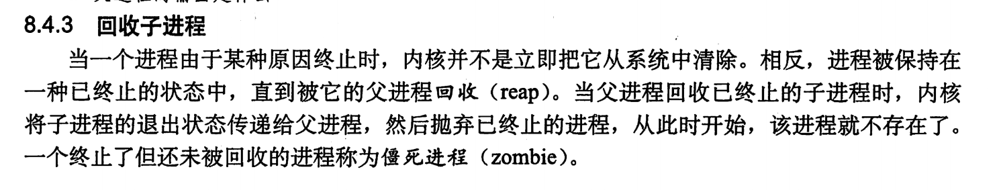
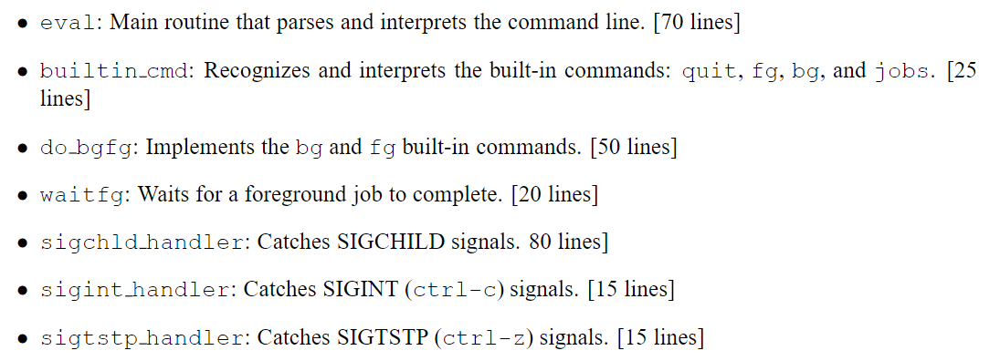

* man 7 signal 查看信号
* The child processes created as a result of interpreting a single command line are known collectively as ajob. In general, a job can consist of multiple child processes connected by Unix pipes.

  解释单个命令行而创建的子过程统称为工作。 通常，工作可以由UNIX管道连接的多个子进程组成。
* 如果命令行以ampersand＆”结尾，则该作业在后台运行，这意味着shell在打印提示并等待下一个命令行之前,不会等待作业终止,否则，作业在前台中运行，这意味着外壳在等待下一条命令行之前等待当前工作终止。 因此，在任何时间点，最多可以在前景中运行一项工作。 但是，可以在后台运行任意数量的作业。
* Unix Shell支持工作控制的概念，该概念允许用户在后台和前台之间来回移动作业和更改作业过程的过程状态（运行，停止或终止）
* 键入CTRL-C导致Sigint信号在前景工作中的每个过程中传递。 SIGINT的默认操作是终止该过程。 同样，键入CTRL-Z会导致SIGTSTP信号传递到前景作业中的每个过程。 SIGTSTP的默认操作是将过程放置在停止状态，在此保留，直到收到Sigcont信号唤醒它。 Unix Shell还提供了支持作业控制的各种内置命令。 例如：

  * jobs 命令可以用来查看当前终端放入后台的工作，包括停止的和正在运行的,工作管理的名字也来源于 jobs 命令。
  * 使用 fg 命令用于把后台工作恢复到前台执行，fg %工作号
  * 可以让后台工作继续在后台执行需要用到 bg 命令。
  * kill `<job>`: Terminate a job.
* 

